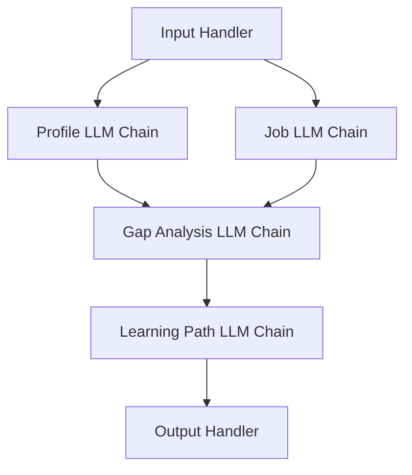

# Skills Gap Analyzer - OpenAI Chain Architecture



## Chain Components

```python
from openai import OpenAI
from typing import Dict
import json
import logging

# Initialize logger
logger = logging.getLogger(__name__)

class BaseChain:
    def __init__(self, client: OpenAI):
        self.client = client
        self.model = "gpt-4-turbo-preview"
    
    async def _call_openai(self, prompt: str) -> Dict:
        try:
            response = await self.client.chat.completions.create(
                model=self.model,
                messages=[{"role": "user", "content": prompt}],
                response_format={"type": "json_object"}
            )
            logger.info(f"OpenAI API call successful: {prompt}")
            return json.loads(response.choices[0].message.content)
        except Exception as e:
            logger.error(f"OpenAI API call failed: {prompt} - {str(e)}")
            raise

class ProfileChain(BaseChain):
    async def analyze_profile(self, profile_text: str) -> Dict:
        prompt = """
        Analyze this LinkedIn profile and extract:
        1. Technical skills with experience level (Beginner/Intermediate/Expert)
        2. Soft skills with demonstrated examples
        3. Years of experience in each area
        
        Profile: {profile_text}
        """
        logger.info("Analyzing profile...")
        return await self._call_openai(prompt.format(profile_text=profile_text))

class JobChain(BaseChain):
    async def analyze_job(self, job_text: str) -> Dict:
        prompt = """
        Analyze this job listing and extract:
        1. Required technical skills with minimum level
        2. Required soft skills
        3. Must-have vs nice-to-have skills
        
        Job Listing: {job_text}
        """
        logger.info("Analyzing job listing...")
        return await self._call_openai(prompt.format(job_text=job_text))

class GapChain(BaseChain):
    async def analyze_gaps(self, profile_skills: Dict, job_requirements: Dict) -> Dict:
        prompt = """
        Compare profile skills against job requirements and identify gaps:
        Profile Skills: {profile_skills_json}
        Job Requirements: {job_requirements_json}
        """
        logger.info("Analyzing gaps...")
        return await self._call_openai(prompt.format(
            profile_skills_json=json.dumps(profile_skills),
            job_requirements_json=json.dumps(job_requirements)
        ))

class LearningChain(BaseChain):
    async def generate_path(self, gaps: Dict) -> Dict:
        prompt = """
        Create a learning path for these skill gaps:
        Gaps: {gaps_json}
        """
        logger.info("Generating learning path...")
        return await self._call_openai(prompt.format(gaps_json=json.dumps(gaps)))

class ChainOrchestrator:
    def __init__(self, api_key: str):
        self.client = OpenAI(api_key=api_key)
        self.profile_chain = ProfileChain(self.client)
        self.job_chain = JobChain(self.client)
        self.gap_chain = GapChain(self.client)
        self.learning_chain = LearningChain(self.client)
    
    async def execute_chain(self, profile_text: str, job_text: str) -> Dict:
        try:
            profile_skills = await self.profile_chain.analyze_profile(profile_text)
            job_requirements = await self.job_chain.analyze_job(job_text)
            gaps = await self.gap_chain.analyze_gaps(profile_skills, job_requirements)
            learning_path = await self.learning_chain.generate_path(gaps)
            
            logger.info("Analysis complete.")
            return {
                "profile_analysis": profile_skills,
                "job_requirements": job_requirements,
                "skill_gaps": gaps,
                "learning_path": learning_path
            }
        except Exception as e:
            logger.error(f"Analysis failed: {str(e)}")
            raise

## Usage

```python
async def main():
    api_key = "your-openai-api-key"
    orchestrator = ChainOrchestrator(api_key)
    
    profile = """[LinkedIn profile text]"""
    job = """[Job listing text]"""
    
    result = await orchestrator.execute_chain(profile, job)
    print(json.dumps(result, indent=2))

if __name__ == "__main__":
    import asyncio
    asyncio.run(main())
```