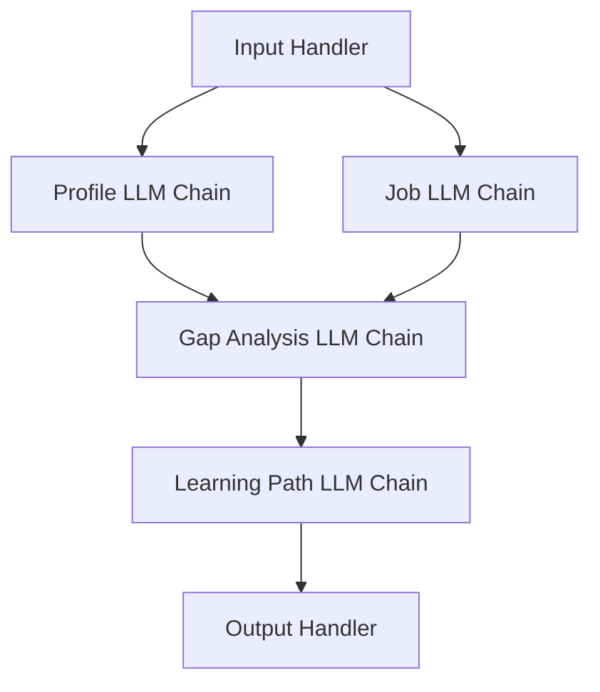

# LLM Chain Flow Documentation

## Chain 1: Profile Analysis
**Purpose:** Extract and categorize skills from LinkedIn profile
```python
# Input Context
profile_prompt = """
Analyze this LinkedIn profile and extract:
1. Technical skills with experience level (Beginner/Intermediate/Expert)
2. Soft skills with demonstrated examples
3. Years of experience in each area

Profile:
{profile_text}

Return in JSON format:
{
    "technical_skills": [{"skill": "", "level": "", "years": ""}],
    "soft_skills": [{"skill": "", "examples": []}]
}
"""
```

## Chain 2: Job Requirements Analysis
**Purpose:** Extract required skills and levels from job posting
```python
# Input Context
job_prompt = """
Analyze this job listing and extract:
1. Required technical skills with minimum level
2. Required soft skills
3. Minimum years of experience
4. Must-have vs nice-to-have skills

Job Listing:
{job_text}

Return in JSON format:
{
    "required_skills": [{"skill": "", "min_level": "", "must_have": true}],
    "min_experience": "",
    "soft_skills": []
}
"""
```

## Chain 3: Gap Analysis
**Purpose:** Compare profile skills against requirements
```python
# Input Context
gap_prompt = """
Compare these profile skills against job requirements and identify:
1. Missing required skills
2. Skills needing level improvement
3. Gap severity (Critical/Moderate/Minor)

Profile Skills: {profile_skills_json}
Job Requirements: {job_requirements_json}

Return in JSON format:
{
    "missing_skills": [{"skill": "", "severity": ""}],
    "upgrade_needed": [{"skill": "", "current": "", "required": "", "severity": ""}]
}
"""
```

## Chain 4: Learning Path Generation
**Purpose:** Create personalized learning plan
```python
# Input Context
learning_prompt = """
Create a learning path to address these skill gaps:
1. Recommended learning resources
2. Estimated time to achieve each skill
3. Learning sequence with prerequisites
4. Progress milestones

Skill Gaps: {gaps_json}

Return in JSON format:
{
    "learning_path": [
        {
            "skill": "",
            "resources": [],
            "estimated_time": "",
            "prerequisites": [],
            "milestones": []
        }
    ]
}
"""
```

## Chain Flow Sequence



## Chain Dependencies
1. Profile Chain ➡ Gap Chain
2. Job Chain ➡ Gap Chain
3. Gap Chain ➡ Learning Chain

## Output Handling
- Each chain validates JSON output
- Failed chains retry with simplified prompts
- Context preserved between chains
- Final output combined from all chains